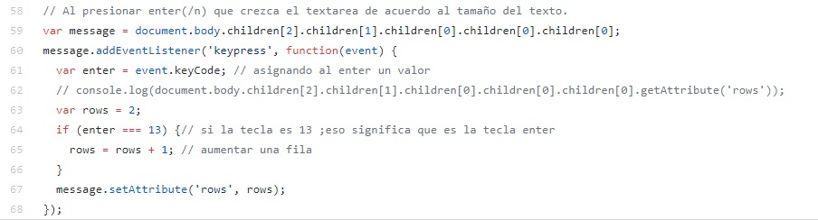

# Reto Twitter

Este proyecto consiste en replicar el newsfeed de Twitter y para completar este reto, hemos creado este repositorio compuesto de la siguiente manera:
* **assets:** _Carpeta en la que se encontraran las siguientes subcarpetas_
  * **iconos:** _Carpeta en la que se encuentran los iconos usados en este proyecto_
  * **images:** _Carpeta en la que se encuentra todas las imagenes usadas en este proyecto_
* **css:** _Carpeta donde se encuentra nuestra hoja de estilos llamada main.css_
* **js:** _Carpeta donde se encuentra la programacion que utilizaremos llamado app.js_  
* **index.html**
* **README.md**

## Objetivo
El reto consiste en replicar replicar el newsfeed de Twitter

**Versión 0.0.1**
* Diseñar un formulario que permita ingresar un texto y un botón para "twittear".
* Agregar un evento de click al botón o de submit al formulario.
* En el evento, obtener el texto.
* Agregar el texto al HTML.

**Versión 0.0.2**
* No ingresar texto vacío (deshabilitar el botón de "twittear").
* Contar la cantidad de caracteres de forma regresiva.

**Versión 0.0.3**
* Si pasa los 140 caracteres, deshabilitar el botón.
* Si pasa los 120 caracteres, mostrar el contador con OTRO color.
* Si pasa los 130 caracteres, mostrar el contador con OTRO color.
* Si pasa los 140 caracteres, mostrar el contador en negativo.

**Versión 0.0.4**
* Al presionar enter(/n) que crezca el textarea de acuerdo al tamaño del texto.

**Versión 0.0.5**
* Si la cantidad de caracteres ingresados (sin dar un enter), supera al tamaño del textarea por defecto, debe de agregarse una línea más para que no aparezca el scroll. (Si en caso aplica)

**Versión 0.0.6**
* Agregar la hora en que se publicó el tweet. En el formato de 24 horas: hh:mm.

## Pseudocodigo

